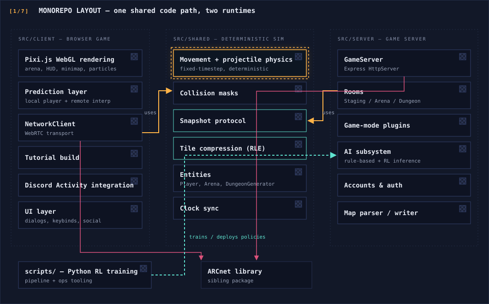
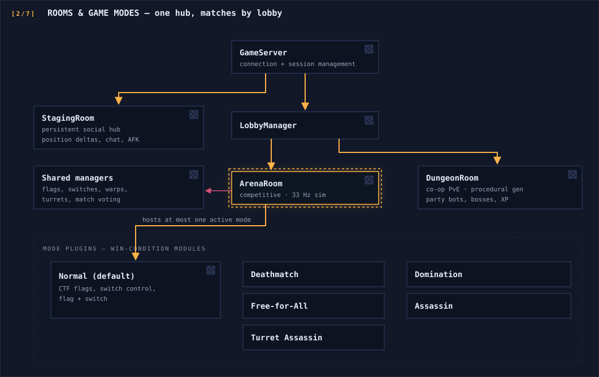
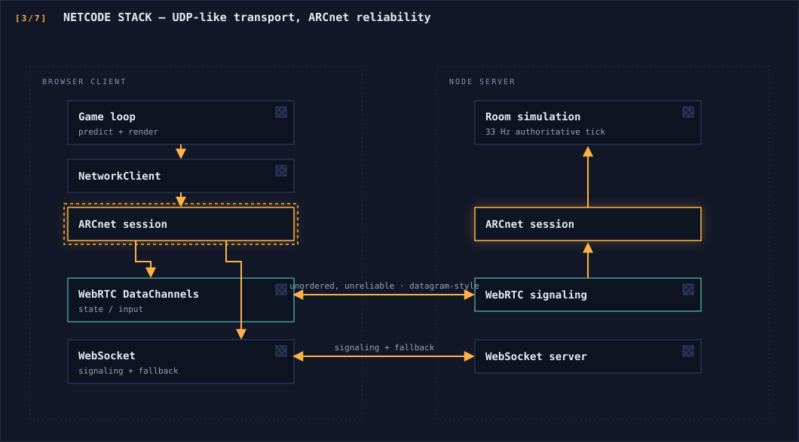
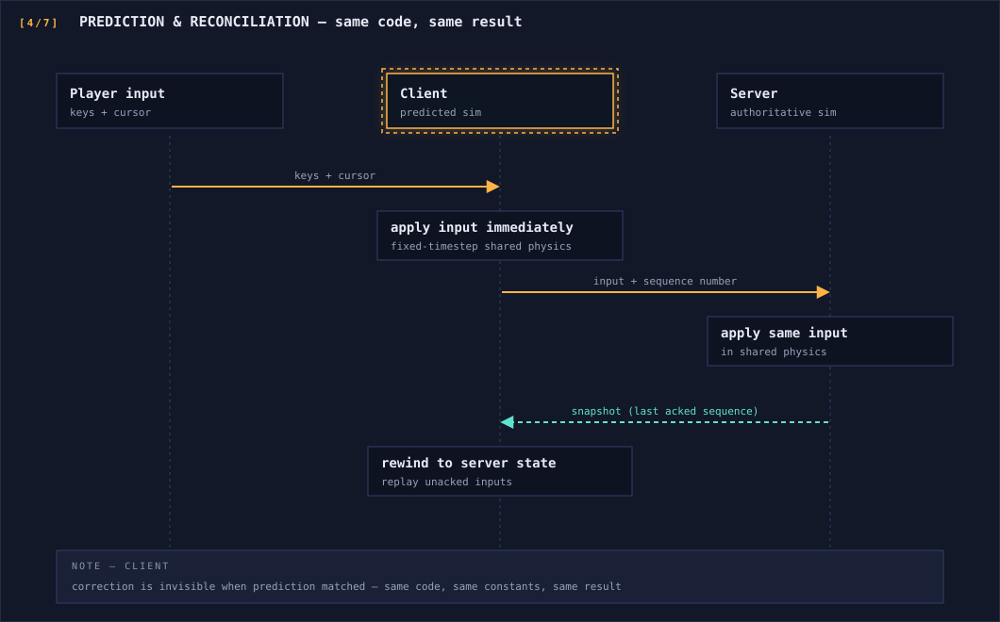
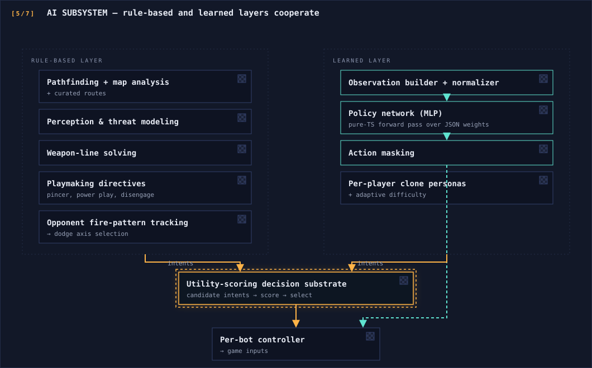
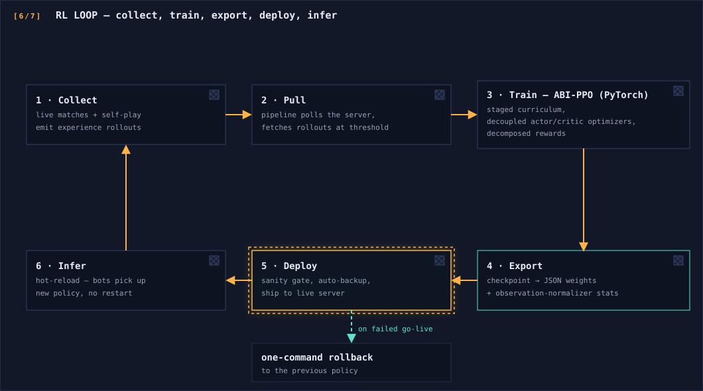
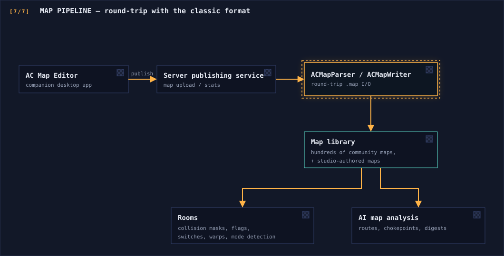

# Arcbound — Architecture Overview

A concept-level tour of how Arcbound is put together. The private repository is a monorepo containing the browser client, the authoritative game server, a deterministic simulation module shared by both, and the Python training pipeline for the game's reinforcement-learning bots.

## Monorepo Layout

The core idea: **anything that determines gameplay outcomes lives in `shared/`** and is compiled into both bundles. The client and server literally execute the same movement and physics code, which is what makes client-side prediction exact rather than approximate.

## Rooms and Game Modes

The server is organized around rooms. Every authenticated player lands in a persistent **staging arena** — a social hub that replaces a lobby screen — and moves from there into matches.

Each mode implements a common hooks contract: the room calls into the active mode once per tick for win-condition checks, and the mode can veto other win paths (for example, kill-race modes disable flag wins). Modes are auto-selected from long-established map naming conventions, and the AI's objective model is mode-aware — bots switch roles when a map has no flags to fight over.

## Netcode Stack

Key properties, bottom-up:

- **Transport** — WebRTC DataChannels configured for unordered, unreliable delivery give the browser UDP-like semantics; a WebSocket path handles signaling and serves as a fallback transport.
- **Reliability** — ARCnet adds what the game actually needs on top: selective-ACK retransmission on reliable channels (ticked at the simulation rate), packet batching, and adaptive quality tiers. State and input travel on separate channels so neither can head-of-line-block the other.
- **Encoding** — snapshots use a compact binary format with per-entity flag bits marking which optional fields are present, cutting bandwidth roughly 60–70% versus JSON; tile grids transfer with run-length encoding.
- **Time** — a ping/response clock-sync exchange maps server ticks onto the client's local clock, so the interpolation buffer schedules remote-player snapshots on a precise timeline instead of inferring timing from jittery packet arrivals.

### Prediction and reconciliation

Both simulations run the identical fixed-timestep code from `shared/`, with frame-time clamping on the client to avoid death spirals. Remote players take the complementary path: buffered interpolation between clock-synced snapshots.

## AI Subsystem

Two layers cooperate inside the server process:

The learned policy has separate actor and critic backbones with discrete heads for movement, firing, and aim (aim expressed as target-relative offset bins). Inference is a few small matrix multiplies per decision — cheap enough to run for every bot inside the game server with no external dependencies.

## The RL Loop: Collect → Train → Export → Deploy → Infer

The loop runs unattended: guardrails (rollout validation, pre-deploy evaluation, closed-loop go-live verification, run-history logging) are always on, and a failed deployment rolls back to the previous known-good policy. Companion tooling renders training metrics, heatmaps, and per-run infographics.

## Map Pipeline & Editor Integration

Arcbound preserves full round-trip compatibility with the classic binary map format: maps made two decades ago load unchanged, and maps written by Arcbound's tooling open cleanly in the companion editor (see **ac-map-editor-overview**). The server doubles as the editor's publishing backend, so the authoring-to-live-rotation path is a single upload. Parsed maps also feed the AI layer, which precomputes routes and spatial digests per map.

## Testing

Simulation, protocol, AI, and mode logic carry Vitest suites — collision edge cases, round flow, flag logic, pathfinding, perception, balance rules, and reserved-name handling among them. Determinism in `shared/` makes the physics tests exact rather than tolerance-based.

---

*See [README.md](README.md) for the feature overview and [SETUP.md](SETUP.md) for the toolchain.*
